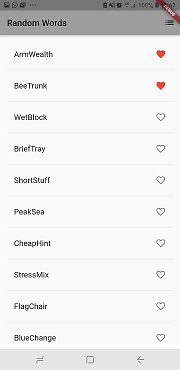

# Flutter
Flutter adalah sebuah framework open-source yang dikembangkan oleh Google untuk membangun antarmuka (user interface/UI) aplikasi Android dan iOS.

## Installasi Flutter 

Yang harus dilakukan dalam penginstallan Flutter adalah :

#### 1. Install JDK
Peralatan esensial yang paling dibutuhkan sebenarnya Flutter SDK, Android SDK, dan Teks Editor saja.Namun, karena kita butuh Android Studio untuk menginstal Android SDK, maka kita juga harus install Java JDK

#### 2. Install Android Studio dan Android SDK
Kita membutuhkan Android Studio untuk menginstall Android SDK.Setelah itu, nanti kita akan memiliki direktori Android di dalam direktori home. Direktori ini berisi Android SDK yang kita butuhkan untuk pengembangan aplikasi android.

#### 3. . Install Flutter SDK
Peralatan yang dibutuhkan berikutnya adalah Fluter SDK.
Silahkan buka ini untuk mendownload Flutter SDK: https://flutter.io/get-started/install/
Flutter SDK tersedia untuk tiga platform: Windows, Linux, dan MacOs.

Silahkan pilih sesuai sistem operasi yang digunakan. Setelah mendownload file .zip nya, lalu ekstark dalam data C. Bukan berarti kita mengekstrak dalam data C secara langsung, tetapi buat folder src terlebih dahulu kemudian baru masukkan file zip kedalamnya kemudian ekstrak.

Kemudian setelah di ekstrak,edit environment variablenya. Klik path lalu masukkan 

	$PATH:~/a/flutter/bin/

Setelah disimpan, silahkan buka terminal baru atau membuka pada flutter_console :
	
	C:\Users\Asus VivoBook>flutter

Hasilnya :

Maka, kita sudah berhasil menginstal Flutter.

#### 4. Pemeriksaan dengan Flutter Doctor

Sebelum kita membuat aplikasi dengan Flutter, kita perisksa dulu kesiapan peralatan yang kita install.

Ketikkan untuk mengecek :

	C:\Users\Asus VivoBook>flutter doctor

Hasilnya :

Berarti, Flutter sudah siap digunakan untuk membuat aplikasi Android.

Jika mendapatkan masalah seperti:
•	Library yang dibutuhkan belum terinstall di komputer kita;
•	Android SDK tidak dapat terdeteksi oleh Flutter
•	dll.
Biasanya akan ada saran link yang harus dibuka dan perintah yang harus diketik.

##  Membuat Project Baru Flutter

Buatlah project baru dengan nama hello_ociii. 

Kelik menu File->New Flutter Project…

Kemudian tentukan jenis project yang akan dibuat. Kita akan membuat project Flutter Application.

Buka folder hasilnya melalui vs code kemudian sambungkan handphine melalui usb dan start debugging .

Pada aplikasi di atas, kita membuat StatelessWidget yang berisi widget MaterialApp(). Kemudian di dalam MateralApp() berisi widget lagi: Scaffold, AppBar, Center, dan Text.
Ini adalah widget dasar…
Penjelasan:
•	MyApp adalah StatelessWidget, merupakan widget induk;
•	MaterialApp adalah widget yang membungkus beberapa widget yang menggunakan tema material design 1;
•	Scaffold adalah widget untuk struktur dasar material design;
•	AppBar adalah widget untuk membuat AppBar;
•	Center adalah Widget layout untuk membuat widget ke tengah;
•	Text adalah wdiget untuk membuat teks.
Hasil dari kasus yang saya kerjakan :

 
 

