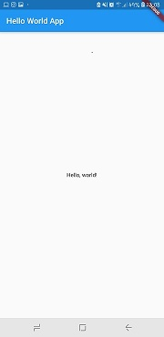
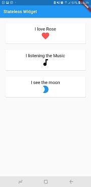
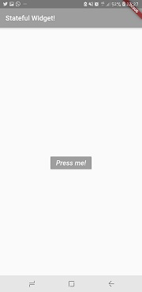
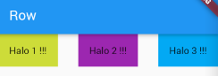
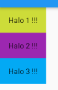
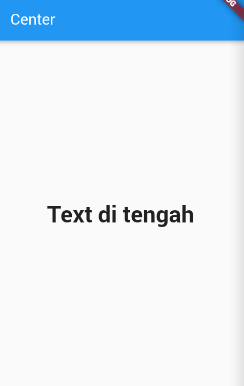
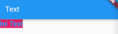
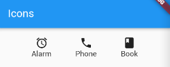

# Mengenal Widgets dan Layout #

## Widget

Widegt merupakan seluruh tampilan seperti tombol, gambar, teks, list, ikon, bahkan satu layar pada handphone tersebut merupakan sekumpulan dari banyak widget.

### Properti pada Widget
Setiap widget memiliki property, misalnya kita membuat sebuah tombol, lalu kita ingin agar warna backgroundnya itu hijau, dan warna tulisannya putih, lalu teksnya kita tebalkan.

### Widget di dalam widget
Dalam membuat aplikasi nantinya tentu kita akan menggunakan banyak widget, pada Flutter setiap Widget umumnya memiliki properti child atau anak, dari properti inilah kita bisa menggunakan widget didalamnya.

Selain child, kita juga mengenal property children yang artinya anak-anak, sesuai dengan namanya, berarti widget tersebut bisa memiliki banyak widget-widget, sebagai contoh kita ingin menampilkan daftar menu makanan, maka tentu akan banyak widget yang berfungsi untuk menampilkan keterangan nama makanan didalamnya.

### General Widget
Ada banyak sekali widget-widget yang telah disediakan pada flutter, pada kali ini kita akan membahas widget apa saja yang paling penting untuk kita pahami saat pertama kali membuat aplikasi menggunakan Flutter ini.

#### 1. Scaffold
Scaffold adalah widget utama untuk membuat sebuah halaman pada flutter, scaffold ini memiliki beberapa parameter yang biasa kita gunakan seperti appBar untuk membuat AppBar, body untuk bagian tubuhnya, atau kita juga bisa menambahkan floating action bar, maupun mengganti warna background bodynya.

    Widget build(BuildContext context) {
    return Scaffold(
    appBar: AppBar(
      title: Text('Sample Code'),
    ),
    body: Center(
      child: Text('You have pressed the button $_count times.')
    ),
    backgroundColor: Colors.blueGrey.shade200,
    floatingActionButton: FloatingActionButton(
      onPressed: () => setState(() => _count++),
      tooltip: 'Increment Counter',
      child: const Icon(Icons.add),
        ),
     );
    }
    

    
#### 2. Stateless

Stateless Widget adalah widget yang berfungsi untuk menampilkan hal-hal yang sifatnya statis mudahnya setelah data ditampilkan maka kita tidak akan merubahnya lagi.Untuk membuatnya kita cukup mengetikkan stl lalu akan ada pilihan untuk membuatnya.

   import 'package:flutter/material.dart';

    void main() {
    runApp(new MaterialApp(
    home: new MyStatelessWidget()
        ));
    }

    class MyStatelessWidget extends StatelessWidget {
        @override
    Widget build(BuildContext context){
    return new Scaffold(
      appBar: new AppBar(title: new Text("Stateless Widget")),
      body: new Container(
        //adding padding around card
        padding: new EdgeInsets.all(20.0),
        child: new Column(
          crossAxisAlignment: CrossAxisAlignment.stretch,
          children: <Widget>[
            // new Text("Hey"),
            // new Text("My name"),
            // new Text("Is Raunak")

            new MyCard(
              title: new Text("I love Flutter", style: new TextStyle(fontSize: 20.0)),
              icon: new Icon(Icons.favorite, size: 40.0, color: Colors.redAccent)
            ),
            new MyCard(
              title: new Text("I love Donuts", style: new TextStyle(fontSize: 20.0)),
              icon: new Icon(Icons.donut_large, size: 40.0, color: Colors.brown)
            ),
            new MyCard(
              title: new Text("I see you", style: new TextStyle(fontSize: 20.0)),
              icon: new Icon(Icons.visibility, size: 40.0, color: Colors.blue)
                       )
                      ]
                     )
                    )
                );
             }
           }

        class MyCard extends StatelessWidget {  
          MyCard({this.title, this.icon});

          final Widget title;
          final Widget icon;

         @override
        Widget build(BuildContext context){
        return new Container(

         padding: new EdgeInsets.only(bottom: 20.0),
             child: new Card(
             child: new Container(
        
          padding: new EdgeInsets.all(15.0),
          child: new Column(
          children: <Widget>[
              // new Text("I love Flutter"),
              // new Icon(Icons.favorite)

              this.title,
              this.icon
                       ]
                     )
                    ) 
                  )
              );
            }
           }

 
        
### 3. Statefull

Statefull Widget adalah widget yang digunakan untuk menampilkan data-data yang dinamis atau data yang kita telah tampilkan sewaktu-waktu dapat mengalami perubahan.Sedangkan untuk statefull kita cukup ketikkan stf lalu akan ada pilihan untuk membuatnya.

    import 'package:flutter/material.dart';

    void main() {
        runApp(new MaterialApp(
    home: new AwesomeButton()
            ));
        }
    
    class AwesomeButton extends StatefulWidget {
       @override
     AwesomeButtonState createState() => new AwesomeButtonState();
        }

    class AwesomeButtonState extends State<AwesomeButton> {

    int counter = 0;
    List<String> strings = ["Flutter", "Is", "Awesome"];
        String displayedString = "";

      void onPressed(){
    setState(() {
      displayedString = strings[counter];
      counter = counter < 2 ? counter+1 : 0;
    });
    }

       @override
    Widget build(BuildContext context){
    return new Scaffold(
      appBar: new AppBar(title: new Text("Stateful Widget!"), backgroundColor: Colors.deepOrange),
      body: new Container(
        child: new Center(
          child: new Column(
            mainAxisAlignment: MainAxisAlignment.center,
            children: <Widget>[
              new Text(displayedString, style: new TextStyle(fontSize: 30.0, fontWeight: FontWeight.bold)),
              new Padding(padding: new EdgeInsets.all(15.0)),
              new RaisedButton(
                child: new Text("Press me!", style: new TextStyle(color: Colors.white, fontStyle: FontStyle.italic, fontSize: 20.0)),
                color: Colors.grey,
                  onPressed: onPressed
                      )
                  ]
                 )
                )
             )
          );
         }
       }
      

      
## Layout
Untuk mengatur tata letak atau posisi widget, maka kita akan mengenal dua buah widget yaitu Row dan Column. 

#### 1. Row 

Row akan menampilkan widget-widget secara horizontal atau sebaris dari kiri ke kanan, widget Row menggunakan property children artinya widget ini bisa diisi oleh banyak widget.

      class MyHomePage extends StatelessWidget {
       @override
       Widget build(BuildContext context) {
          return Scaffold(
        appBar: AppBar(
          title: Text("Row"),
        ),
        body: Row(
          mainAxisAlignment: MainAxisAlignment.spaceBetween,
          children: <Widget>[
            Container(
              child: Text("Halo 1 !!!"),
              color: Colors.lime,
              padding: EdgeInsets.all(16.0),
            ),
            Container(
              child: Text("Halo 2 !!!"),
              color: Colors.purple,
              padding: EdgeInsets.all(16.0),
            ),
            Container(
              child: Text("Halo 3 !!!"),
              color: Colors.lightBlue,
              padding: EdgeInsets.all(16.0),
            ),
          ],
        ));
       }
     }

          
##### 2. Column 

Column berlaku sebaliknya widget akan mengarah secara vertikal atau dari atas kebawah, widget ini juga menggunakan property children artinya widget ini bisa diisi oleh banyak widget.

      class MyHomePage extends StatelessWidget {
        @override
      Widget build(BuildContext context) {
        return Scaffold(
        appBar: AppBar(
          title: Text("Column"),
        ),
        body: Column(
          children: <Widget>[
            Container(
              child: Text("Halo 1 !!!"),
              color: Colors.lime,
              padding: EdgeInsets.all(16.0),
            ),
            Container(
              child: Text("Halo 2 !!!"),
              color: Colors.purple,
              padding: EdgeInsets.all(16.0),
            ),
            Container(
              child: Text("Halo 3 !!!"),
              color: Colors.lightBlue,
              padding: EdgeInsets.all(16.0),
            ),
          ],
        ));
        } 
      }
      

    
#### 3. Center

Center berfungsi agar posisi widget yang kita buat berada ditengah.

      ...
       body: Center(
       child: Text("Text di tengah", 
                  style: TextStyle(
                            fontSize: 30.0, 
                            fontWeight: FontWeight.bold),
                            ),
        )
      ...

 

#### 4. Text

Text berfungsi untuk menampilkan sebuah teks biasa, atau bisa kita berikan style dengan menambahkan property style.

    ...
    body: Text('Ini Text', style: TextStyle(
                                  color: Colors.blue,
                                  backgroundColor: Colors.pink,
                                  fontSize: 20.0,
                                  fontStyle: FontStyle.italic,
                                  fontWeight: FontWeight.bold
                                  ),)
     ...

#### 5. Icon

Widget ini untuk menggunakan icon yang telah disediakan, berikut adalah contohnya.

      ...
      body: Container(
          padding: EdgeInsets.all(16.0),
          child: Row(
            mainAxisAlignment: MainAxisAlignment.spaceEvenly,
            children: <Widget>[
              Column(
                children: <Widget>[
                  Icon(Icons.access_alarm),
                  Text('Alarm')
                ],
              ),
              Column(
                children: <Widget>[
                  Icon(Icons.phone),
                  Text('Phone')
                ],
              ),
              Column(
                children: <Widget>[
                  Icon(Icons.book),
                  Text('Book')
                ],
              ),
            ],
          ),
        )
      ... 
      

#### 6. Stack

Alih-alih berorientasi linear (baik secara horizontal atau vertikal), sebuah Stackwidget memungkinkan Anda menempatkan widget di atas satu sama lain dalam urutan cat. Anda kemudian dapat menggunakan Positionedwidget pada anak-anak a Stackuntuk menempatkan mereka relatif terhadap tepi atas, kanan, bawah, atau kiri tumpukan. Tumpukan didasarkan pada model tata letak posisi absolut web.

#### 7. Container
The Containerwidget memungkinkan Anda membuat elemen visual persegi panjang. Wadah dapat didekorasi dengan BoxDecoration, seperti latar belakang, perbatasan, atau bayangan. A Containerjuga dapat memiliki margin, bantalan, dan batasan yang diterapkan pada ukurannya. Selain itu, a Containerdapat ditransformasikan dalam ruang tiga dimensi menggunakan matriks.
