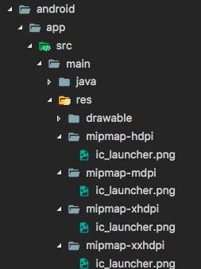

# Asset and Navigation 
Untuk menampilkan gambar pada flutter, diperlukan widget “image”. Untuk menampilkannya, dibutuhkan asset sehingga ganbar tersebut bisa tampil. Asset adalah file yang dibundel dan digunakan dengan aplikasi, yang dapat diakses saat runtime. Jenis aset yang umum termasuk data statis (misalnya, file JSON), file konfigurasi, ikon, dan gambar (JPEG, WebP, GIF, WebP / GIF animasi, PNG, BMP, dan WBMP).

## Asset

#### Menentukan Asset
Untuk menggunakan asset ini, asset di letakkan pada pubsec.yaml.File asset tersebut, diletakkan dalam root proyek untuk mengidentifikasi aset yang diperlukan oleh suatu aplikasi.

Contoh penggunaan asset :
		flutter:
     assets:
    			- assets/rose.png
    			- assets/jasmine.png
Untuk memasukkan semua aset di bawah folder/direktori, tentukan nama direktori dengan /karakter di akhir:
flutter:
 		     assets:
    			- assets/

#### Memperbarui ikon aplikasi
Di direktori root proyek Flutter Anda, navigasikan ke .../android/app/src/main/res. Berbagai folder sumber daya bitmap seperti mipmap-hdpi sudah berisi gambar placeholder bernama ic_launcher.png. Ganti dengan aset yang Anda inginkan sesuai dengan ukuran ikon yang disarankan per kepadatan layer

#### Memperbarui launch screen
Untuk menambahkan "layar splash" ke aplikasi Flutter, navigasikan ke .../android/app/src/main. Di res/drawable/launch_background.xml, gunakan daftar lapisan ini XML yang dapat digambar untuk menyesuaikan tampilan layar peluncuran Anda. Templat yang ada memberikan contoh menambahkan gambar ke tengah layar splash putih dalam kode komentar. Anda dapat menghapus komentarnya atau menggunakan drawables lainnya untuk mencapai efek yang diinginkan.

#### Menavigasi dengan rute yang ditentukan
Menentukan rute yang ditentukan , dan gunakan rute yang dinamai untuk navigasi.
Untuk bekerja dengan rute ini, gunakan fungsi Navigator.pushNamed(). Contoh ini mereplikasi fungsionalitas dari resep asli, menunjukkan cara menggunakan rute bernama menggunakan langkah-langkah berikut:
1.	Buat dua layar.
2.	Tentukan rute.
3.	Arahkan ke layar kedua menggunakan Navigator.pushNamed().
4.	Kembali ke layar pertama menggunakan Navigator.pop().
