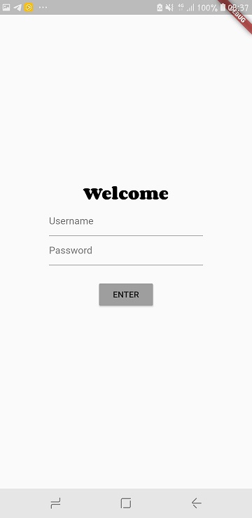
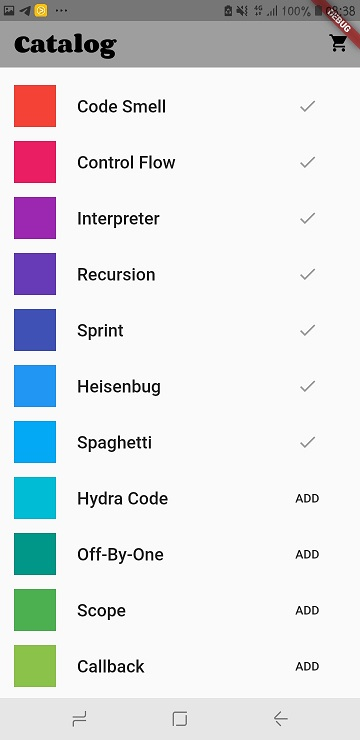
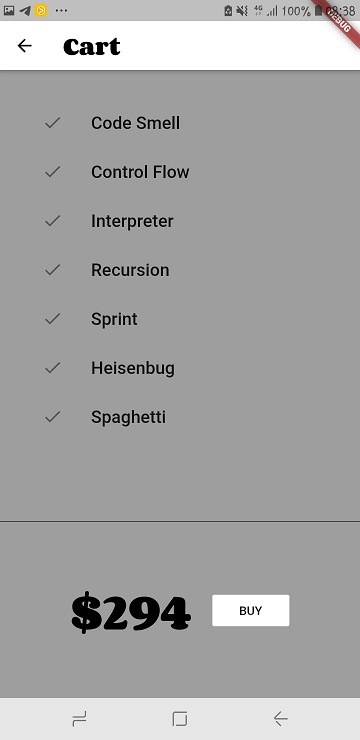
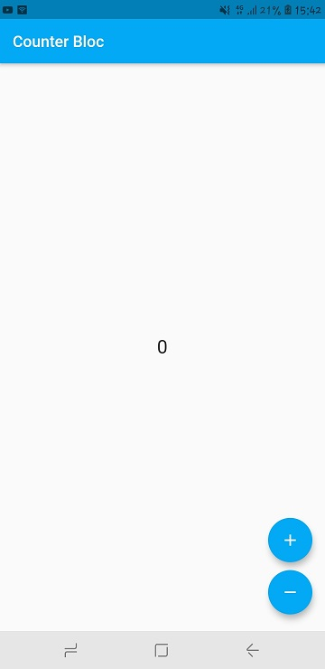
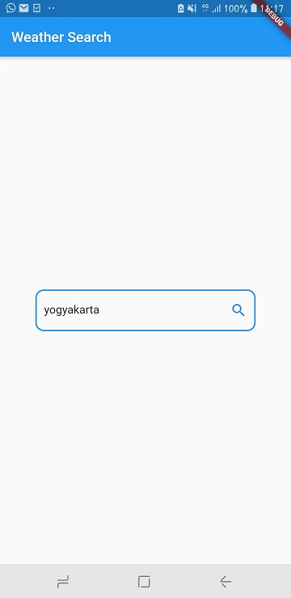
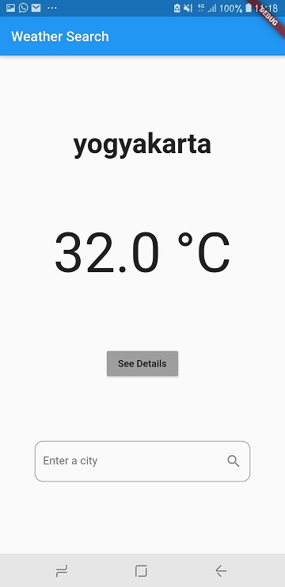
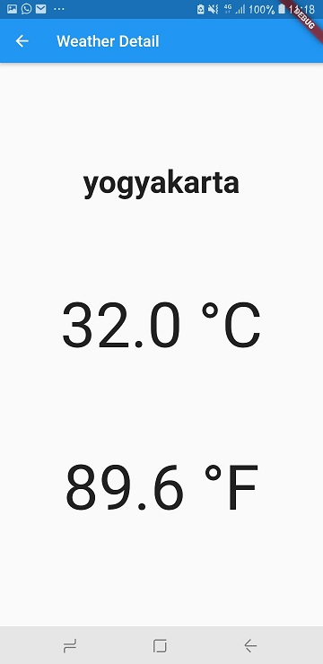

# State Management

State Management mengacu pada manajemen keadaan satu atau lebih kontrol antarmuka pengguna seperti bidang teks , tombol OK, tombol radio,
dll. Dalam teknik pemrograman antarmuka pengguna ini, keadaan satu kontrol UI tergantung pada keadaan kontrol UI lainnya. Misalnya, 
kontrol UI yang diatur oleh state seperti tombol akan berada dalam status diaktifkan ketika bidang input memiliki nilai input yang valid
dan tombol akan berada dalam kondisi dinonaktifkan ketika bidang input kosong atau memiliki nilai yang tidak valid.

## Declarative Pemogramming

pemrograman deklaratif adalah paradigma pemrograman — gaya membangun struktur dan elemen program komputer — yang mengekspresikan logika
perhitungan tanpa menjelaskan aliran kontrolnya

      UI = f ( state )

UI is the layout on the screen,
F is your build methods,
State is the applicaton state

## Provider

Aplikasi ini memiliki 3 layar, yaitu yang pertama adalah layar login. Dimana user akan diminta untuk memasukkan dtaa username dan 
password namun disini fungsi tersebut tidak berguna. Jadi langsung tekan enter saja

Terdapat dua layar lainnya yaitu catalog dan cart. Aplikasi ini bisa digunakan menjadi aplikasi belanja . Pada layar katalog mencakup
AppBar dan bisa digulir dari banyak ListItems.

Ketika user mengklik salah satu item dalam catalog, maka barag tersebut akan ditambahkan ke cart. 

Saat cart di klik maka akan muncul barang barang yang telah diklik beserta total hargab barang seluruhnya di layar paling bawah

Builder dalam aplikasi ini di bangun oleh 3 arguments. Yang pertama adalah context, yang didapatkan setiap metode build.
Yang kedua adalah builder funcyionnyang merupakan turunan dari ChangeNotifier.
Yang ketiga adalah child, yang berguna untuk optimasi

## BloC

BloC merupakan komponen logika bisnis yang berguna untuk melakukan manajemen State di flutter. Menulis aplikasi menggunakan pola Blok 
dari awal menciptakan banyak kode boilerplate. Itu sebabnya ada library luar biasa yang menyelamatkan Anda dari berurusan dengan seluk-
beluk Blok, seperti Streams dan Sinks ...

Aplikasi ini merupakan simulasi dari aplikasi ramalan cuaca sederhana yang hanya akan menghasilkan suhu acak.Pertama adalah kita memasukkan nama kota secara acak. 

Fungsi event GetWeather dikirim, kemudian akan menampilkan status dari WeatherLoading dan kemudian suhu acak akan tampil.

Saat di klik, maka akan muncul detail suhu nya

